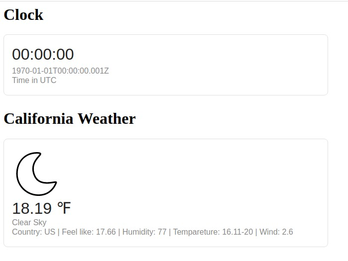

# simple-weather-status
simple realtime clock &amp; weather status


## Demo

Demo available at https://thoverik.github.io/simple-weather-status/




## Installation

Put index.html in your root webserver path, maybe:

```
/var/www/html/
```

## Contributing
Pull requests are welcome. For major changes, please open an issue first to discuss what you would like to change.

Please make sure to update tests as appropriate.

## License
[MIT](https://choosealicense.com/licenses/mit/)
